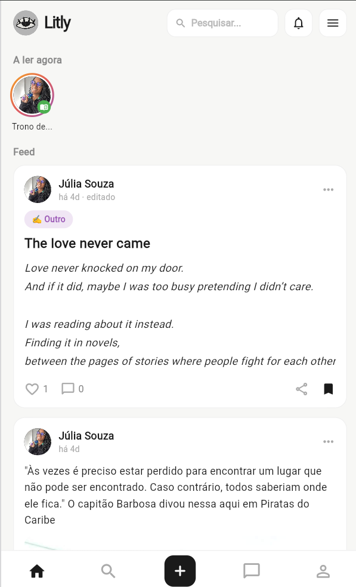
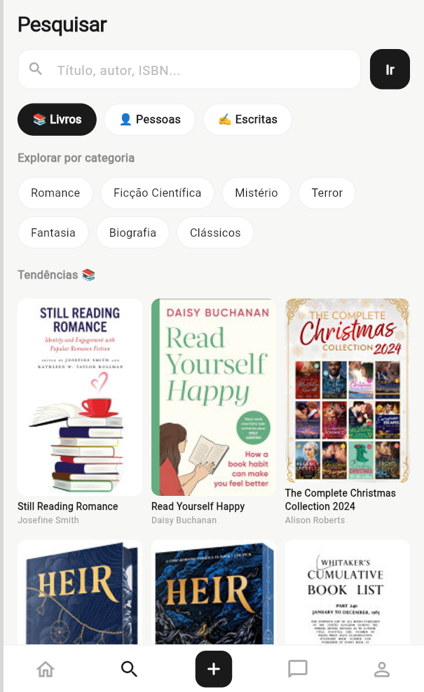
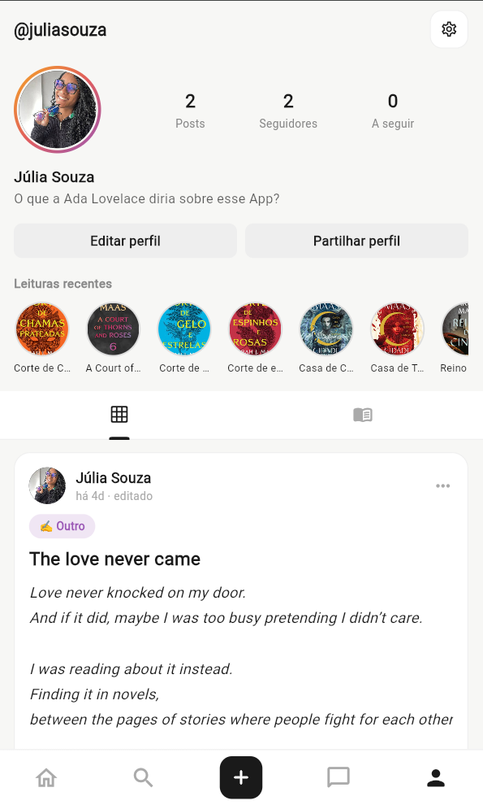

# Litly 📚

**Litly** é uma rede social dedicada a amantes de livros e leitura. A aplicação permite aos utilizadores partilhar o que estão a ler, descobrir novas obras, escrever os seus próprios textos, interagir com outros leitores e conversar em tempo real.

### 🌐 Experimenta a aplicação

👉 **[liltymobile.web.app](https://liltymobile.web.app)**

> A app está publicada na web (Firebase Hosting) e otimizada para telemóvel — em ecrãs maiores aparece centrada num formato de "telemóvel".

---

## 🚀 Funcionalidades

### Social
- **Autenticação:** Registo e Login seguros via Firebase Authentication (email/password e Google).
- **Feed Principal:** Publicações da comunidade em tempo real.
- **Seguir / Seguidores:** Sistema completo de seguidores, incluindo **contas privadas** com pedidos de seguir (aceitar/recusar).
- **Notificações:** Avisos de gostos, comentários, novos seguidores e pedidos aceites.
- **Detalhe da publicação:** Toca num post para o abrir por inteiro com comentários (estilo Twitter).
- **Chat em tempo real:** Mensagens privadas, com pedidos de mensagem para quem não te segue.
- **Stories:** Partilha o livro que estás a ler, visível na aba de mensagens.
- **Bloquear utilizadores** e **reportar** conteúdo.

### Livros & Escrita
- **Explorar:** Pesquisa de livros (Google Books), pessoas e textos da comunidade.
- **Criar publicação:** Partilha leituras, opiniões e fotos.
- **Escrita criativa:** Publica crónicas, poemas, contos e reflexões.
- **Estante pessoal:** Marca livros como _Lidos_, _A ler_ e _Quero ler_, com sinopses.
- **Meta de leitura anual** ajustável e estatísticas de leitura.

### Perfil & Personalização
- **Perfil do utilizador:** Biografia, foto, estatísticas e histórico de publicações.
- **Editar perfil** com validação de nome de utilizador único.
- **Modo escuro** completo.
- **Painel de Administrador:** Estatísticas, moderação de publicações, gestão de reports, feedback e utilizadores.

---

## 📸 Capturas de Ecrã

| Feed Principal | Explorar | Perfil |
|:---:|:---:|:---:|
|  |  |  |

| Publicação | Chat | Modo Escuro |
|:---:|:---:|:---:|
|  |  |  |


---

## 🛠️ Tecnologias Utilizadas

- **Frontend:** [Flutter](https://flutter.dev/) (Dart) — Web
- **Backend / Serviços:** [Firebase](https://firebase.google.com/)
  - **Firebase Authentication** — gestão de utilizadores
  - **Cloud Firestore** — base de dados em tempo real (posts, utilizadores, mensagens, notificações)
  - **Firebase Hosting** — alojamento da aplicação web
  - **Regras de Segurança do Firestore** — proteção de dados endurecida e testada
- **APIs externas:** Google Books API (pesquisa de livros)

---

## 📦 Estrutura do Projeto

A lógica principal encontra-se em `lib/`, onde `main.dart` é o ponto de entrada (tema, rotas e navegação):

```
lib/
├── main.dart              # Ponto de entrada, tema e navegação
├── theme.dart             # Temas claro/escuro e helpers visuais
├── firebase_options.dart  # Configuração do Firebase
├── screens/               # Ecrãs da aplicação
│   ├── home_screen.dart           # Feed principal
│   ├── explore_screen.dart        # Descoberta e pesquisa
│   ├── create_post_screen.dart    # Criar publicação / escrita
│   ├── chat_list_screen.dart      # Conversas e chat
│   ├── profile_screen.dart        # Perfil e definições
│   ├── other_user_profile_screen.dart
│   └── admin_panel_screen.dart    # Painel de administrador
├── services/              # Lógica de negócio (Firestore/Auth)
└── widgets/               # Componentes reutilizáveis
```

---

## ⚙️ Como Executar o Projeto Localmente

### Pré-requisitos
- [Flutter SDK](https://docs.flutter.dev/get-started/install) instalado.
- Conta e projeto configurado no [Firebase](https://console.firebase.google.com/).
- Um navegador (Chrome) ou dispositivo/emulador configurado.

### Passos

1. **Clonar o repositório:**
   ```bash
   git clone https://github.com/jul1asouz4/LitlyApp---JuliaSouza2223248.git
   cd LitlyApp---JuliaSouza2223248
   ```

2. **Instalar as dependências:**
   ```bash
   flutter pub get
   ```

3. **Executar a aplicação:**
   ```bash
   flutter run -d chrome
   ```

4. **(Opcional) Gerar a versão de produção para a web:**
   ```bash
   flutter build web --release
   ```

---

## 👩‍💻 Autora

Projeto desenvolvido por **Júlia Souza** no âmbito da Prova de Aptidão Profissional (PAP).
